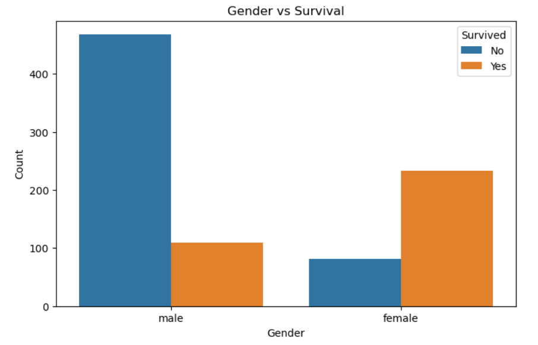
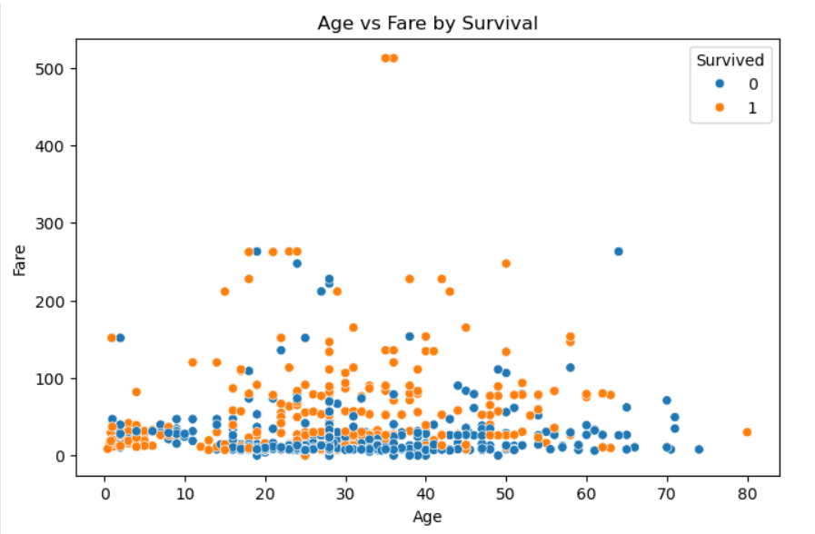
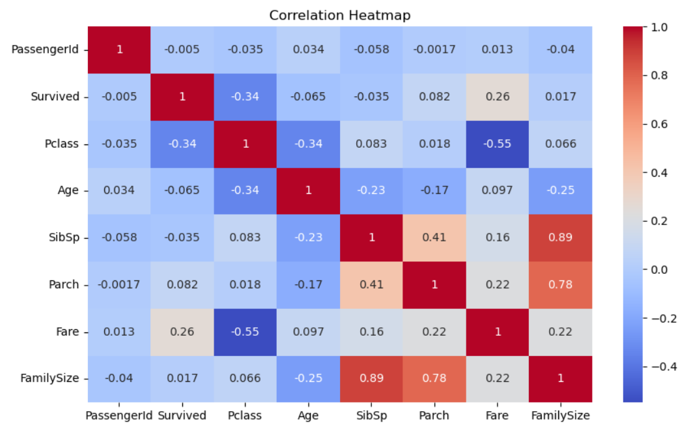

# 🚢 Exploratory Data Analysis (EDA) on Titanic Dataset

## 📖 Project Overview

This project performs Exploratory Data Analysis (EDA) on the Titanic dataset to identify patterns, relationships, and key factors influencing passenger survival.

The analysis includes:
- Data cleaning
- Univariate analysis
- Bivariate analysis
- Correlation analysis
- Visual trend identification

---

## 🛠️ Technologies Used

- Python  
- Pandas  
- NumPy  
- Matplotlib  
- Seaborn  
- Jupyter Notebook  

---

## 🧹 Data Cleaning Steps

- Filled missing values in **Age** using median.
- Filled missing values in **Embarked** using mode.
- Dropped **Cabin** column due to excessive missing values.
- Checked for duplicates.

---

## 📊 Exploratory Data Analysis

### 🔹 Univariate Analysis
- Age Distribution (Histogram)
- Fare Distribution (Histogram)

### 🔹 Bivariate Analysis
- Gender vs Survival (countplot)
- Age vs Survival (Boxplot)
- Fare vs Survival (Boxplot)

### 🔹 Correlation Analysis
- Correlation Heatmap
- Pairplot for multi-variable relationship analysis

---

## 🔍 Key Insights

- Female passengers had significantly higher survival rates.
  
- First-class passengers were more likely to survive.
- Higher fare passengers showed greater survival probability.
  
- Age had moderate influence on survival.
  
- Socio-economic status strongly influenced survival chances.

---

## 📈 Visualizations Used

- Histograms  
- Countplots  
- Boxplots  
- Scatterplots  
- Heatmap  
- Pairplot  

---

## 🎯 Conclusion

Exploratory Data Analysis reveals that passenger survival was strongly influenced by gender and socio-economic class. Higher ticket class and fare significantly increased survival probability, while age showed a weaker relationship. 
